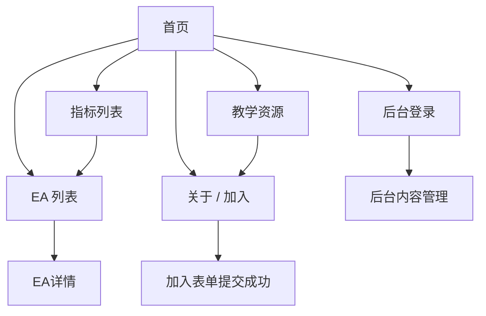

## 1. Product Overview
面向访问者展示合作平台、EA列表与关键指标，并提供教学资源与关于/加入入口。
支持多语言切换、后台发布内容、表单收集线索、微信二维码浮窗，并在首页提供科幻星空互动动效与SEO关键词方案。

## 2. Core Features

### 2.1 User Roles
| 角色 | 注册/进入方式 | 核心权限 |
|------|----------------|----------|
| 访客 | 无需登录 | 浏览站点内容、切换语言、提交加入表单、查看微信二维码浮窗 |
| 后台编辑/管理员 | Supabase Auth 登录 | 发布/编辑合作平台、EA、指标、教学链接；配置首页SEO与微信二维码 |

### 2.2 Feature Module
本产品主要页面如下：
1. **首页**：合作平台展示区、EA精选入口、指标亮点、教学入口、语言切换、科幻星空互动动效、SEO落地。
2. **EA 列表**：EA筛选/排序、EA卡片列表、EA详情跳转。
3. **指标列表**：指标分类/筛选、指标解释说明、与EA/策略关联入口。
4. **教学资源**：教学链接列表（外链）、分类与搜索。
5. **关于 / 加入**：团队/项目介绍、加入表单、微信二维码浮窗触发与展示。
6. **后台内容管理**：登录、内容发布（平台/EA/指标/教学）、站点配置（多语言文案、SEO、二维码）。

### 2.3 Page Details
| Page Name | Module Name | Feature description |
|-----------|-------------|---------------------|
| 首页 | 顶部导航与语言切换 | 展示主导航（首页/EA/指标/教学/关于-加入），切换语言并在全站生效 |
| 首页 | 科幻星空互动动效 | 渲染星空/粒子背景；支持鼠标/滚轮轻交互；动效不影响首屏文本可抓取与可访问性 |
| 首页 | 合作平台展示 | 展示平台Logo/简介/跳转链接，支持后台配置排序与上下线 |
| 首页 | EA精选与指标亮点 | 展示精选EA卡片与关键指标摘要，提供进入列表页的CTA |
| 首页 | SEO关键词落地 | 配置页面Title/Description/H1；在内容区承载关键词文案与FAQ（由后台维护） |
| EA 列表 | 筛选/排序与列表 | 按分类/标签/风险等级/收益等筛选与排序；展示EA卡片（名称/摘要/关键指标） |
| EA 列表 | EA详情（弹层或独立区块） | 展示EA介绍、适用平台、核心指标、相关教学链接；提供咨询/加入入口 |
| 指标列表 | 指标浏览与解释 | 展示指标列表与解释（术语/计算口径/注意事项），支持分类切换与搜索 |
| 指标列表 | 关联入口 | 从指标跳转到相关EA或教学资源（以标签/关联字段实现） |
| 教学资源 | 链接列表与分类 | 展示教学链接（标题/来源/标签/外链），支持分类与关键词搜索 |
| 关于 / 加入 | 关于内容展示 | 展示项目介绍、合作方式、常见问题（后台可维护） |
| 关于 / 加入 | 加入表单 | 收集姓名/联系方式/意向/备注；提交成功提示与后续引导 |
| 全站 | 微信二维码浮窗 | 右下角悬浮按钮；点击弹出二维码与说明文案；二维码资源由后台配置 |
| 后台内容管理 | 登录与权限 | 使用邮箱/密码登录；未登录不可访问后台路由 |
| 后台内容管理 | 内容发布与编辑 | CRUD：合作平台、EA、指标、教学链接；支持中英文等多语言字段；支持草稿/发布状态 |
| 后台内容管理 | 站点配置 | 配置微信二维码图片、首页SEO关键词与落地文案、全站基础Meta |
| 安全与性能控制 | 防刷限流 | 对无需登录的开放接口（如留言/表单提交）限制同一 IP/设备 ID 的短时间内提交次数；超过限制提示稍后再试 |
| 安全与性能控制 | 本地缓存 | 前端按策略（如 1 小时或版本号比对）缓存全站通用数据（平台列表、基础配置等），减少数据库读取消耗，提升访问速度 |

## 3. Core Process
- 访客流：进入首页 → 被星空动效与关键信息吸引 → 浏览合作平台/EA精选/指标亮点 → 进入EA列表或指标列表深入查看 → 打开教学资源外链学习 → 在关于/加入页提交表单或通过微信二维码联系。
- 后台编辑流：进入后台登录 → 管理合作平台/EA/指标/教学内容（多语言）→ 配置首页SEO关键词与落地文案、二维码 → 发布后在前台即时生效。

