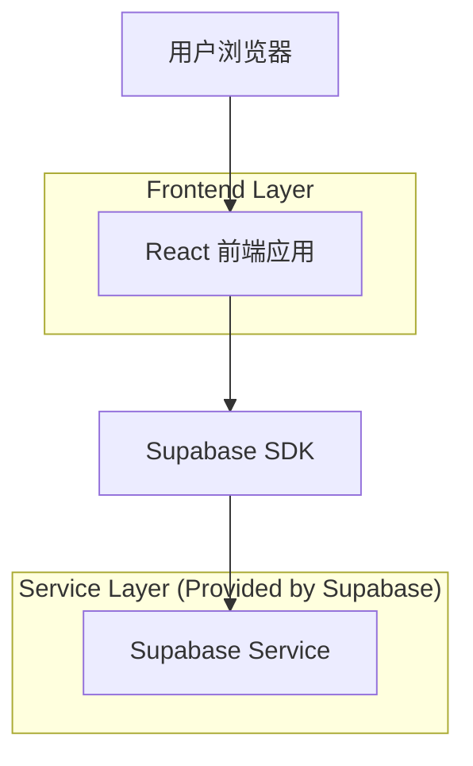
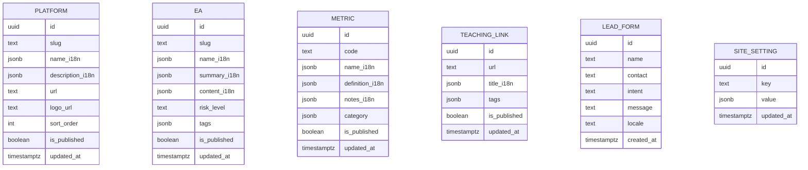

## 1.Architecture design


## 2.Technology Description
- Frontend: React@18 + vite + TypeScript + tailwindcss@3 + react-router
- i18n: i18next（或同等 React i18n 方案）
- 动效: three.js + @react-three/fiber（星空粒子交互）；对SEO内容采用“可抓取文本优先”布局
- Backend: Supabase（Auth + PostgreSQL + Storage）
  - **核心作用**：作为唯一的 Serverless 后端，提供数据库（存 EA/平台/指标等数据）、存储（存图片/安装包等文件）、以及后台管理人员的账号登录认证。
  - **使用方式**：前端通过 `@supabase/supabase-js` 直接调用 API 获取数据；无需自己写 Node.js/Java 等后端接口代码。
- 性能与安全: 
  - 本地缓存：前端使用 SWR / React Query 或 localStorage 对不常变动的数据（如平台列表、配置）做缓存。
  - 防刷限流：Supabase 自带基础的 API Rate Limiting；在此基础上，针对开放接口（如提交表单），前端增加设备指纹/本地频控，数据库层通过 Row Level Security (RLS) 或 Edge Functions 限制同一 IP/设备的写入频率。

## 3.Route definitions
| Route | Purpose |
|-------|---------|
| / | 首页（合作平台、精选EA、指标亮点、星空动效、SEO落地内容） |
| /eas | EA列表与筛选 |
| /metrics | 指标列表与解释 |
| /learn | 教学资源列表（外链） |
| /about | 关于/加入（含表单与二维码浮窗触发） |
| /admin/login | 后台登录 |
| /admin | 后台内容管理与站点配置（受保护路由） |

## 6.Data model(if applicable)

### 6.1 Data model definition


### 6.2 Data Definition Language
Platform Table (platforms)
```
CREATE TABLE platforms (
  id UUID PRIMARY KEY DEFAULT gen_random_uuid(),
  slug TEXT UNIQUE NOT NULL,
  name_i18n JSONB NOT NULL DEFAULT '{}'::jsonb,
  description_i18n JSONB NOT NULL DEFAULT '{}'::jsonb,
  url TEXT,
  logo_url TEXT,
  sort_order INT DEFAULT 0,
  is_published BOOLEAN DEFAULT FALSE,
  updated_at TIMESTAMPTZ DEFAULT NOW()
);

GRANT SELECT ON platforms TO anon;
GRANT ALL PRIVILEGES ON platforms TO authenticated;
```

EA Table (eas)
```
CREATE TABLE eas (
  id UUID PRIMARY KEY DEFAULT gen_random_uuid(),
  slug TEXT UNIQUE NOT NULL,
  name_i18n JSONB NOT NULL DEFAULT '{}'::jsonb,
  summary_i18n JSONB NOT NULL DEFAULT '{}'::jsonb,
  content_i18n JSONB NOT NULL DEFAULT '{}'::jsonb,
  risk_level TEXT,
  tags JSONB NOT NULL DEFAULT '[]'::jsonb,
  is_published BOOLEAN DEFAULT FALSE,
  updated_at TIMESTAMPTZ DEFAULT NOW()
);

CREATE INDEX idx_eas_published_updated ON eas (is_published, updated_at DESC);
GRANT SELECT ON eas TO anon;
GRANT ALL PRIVILEGES ON eas TO authenticated;
```

Metric Table (metrics)
```
CREATE TABLE metrics (
  id UUID PRIMARY KEY DEFAULT gen_random_uuid(),
  code TEXT UNIQUE NOT NULL,
  name_i18n JSONB NOT NULL DEFAULT '{}'::jsonb,
  definition_i18n JSONB NOT NULL DEFAULT '{}'::jsonb,
  notes_i18n JSONB NOT NULL DEFAULT '{}'::jsonb,
  category JSONB NOT NULL DEFAULT '{}'::jsonb,
  is_published BOOLEAN DEFAULT FALSE,
  updated_at TIMESTAMPTZ DEFAULT NOW()
);

GRANT SELECT ON metrics TO anon;
GRANT ALL PRIVILEGES ON metrics TO authenticated;
```

Teaching Links Table (teaching_links)
```
CREATE TABLE teaching_links (
  id UUID PRIMARY KEY DEFAULT gen_random_uuid(),
  url TEXT NOT NULL,
  title_i18n JSONB NOT NULL DEFAULT '{}'::jsonb,
  tags JSONB NOT NULL DEFAULT '[]'::jsonb,
  is_published BOOLEAN DEFAULT FALSE,
  updated_at TIMESTAMPTZ DEFAULT NOW()
);

GRANT SELECT ON teaching_links TO anon;
GRANT ALL PRIVILEGES ON teaching_links TO authenticated;
```

Lead Form Table (lead_forms)
```
CREATE TABLE lead_forms (
  id UUID PRIMARY KEY DEFAULT gen_random_uuid(),
  name TEXT,
  contact TEXT NOT NULL,
  intent TEXT,
  message TEXT,
  locale TEXT,
  created_at TIMESTAMPTZ DEFAULT NOW()
);

GRANT INSERT ON lead_forms TO anon;
GRANT ALL PRIVILEGES ON lead_forms TO authenticated;
```

Site Settings Table (site_settings)
```
CREATE TABLE site_settings (
  id UUID PRIMARY KEY DEFAULT gen_random_uuid(),
  key TEXT UNIQUE NOT NULL,
  value JSONB NOT NULL DEFAULT '{}'::jsonb,
  updated_at TIMESTAMPTZ DEFAULT NOW()
);

GRANT SELECT ON site_settings TO anon;
GRANT ALL PRIVILEGES ON site_settings TO authenticated;
```

Notes:
- 多语言字段采用 JSONB（如 {"zh-CN":"...","en":"..."}），前端按 locale 选择回退策略。
- WeChat 二维码建议存 Supabase Storage，URL 写入 site_settings（key=wechat_qr）。
- SEO 关键词与落地文案建议写入 site_settings（key=seo_home / seo_defaults）。
