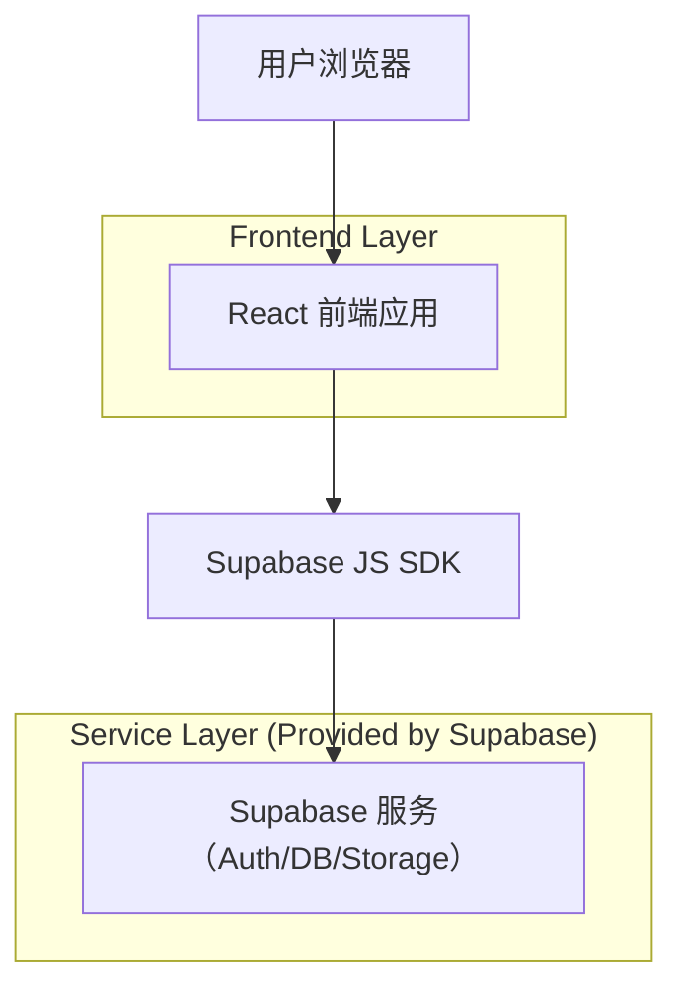
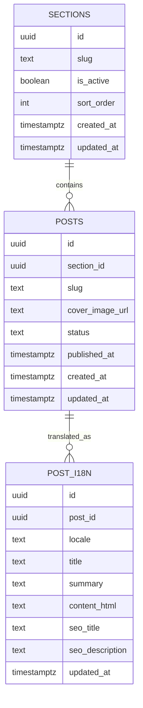

## 1.Architecture design


## 2.Technology Description
- Frontend: React@18 + vite + tailwindcss@3 + react-router
- Backend: Supabase（Authentication + PostgreSQL + Storage）

## 3.Route definitions
| Route | Purpose |
|-------|---------|
| / | 首页：品牌展示、栏目入口、精选内容 |
| /:lang | 多语言入口（可选）：以语言前缀或参数决定内容语言 |
| /:lang/section/:slug | 栏目内容列表页：某栏目内容列表 |
| /:lang/post/:slug | 内容详情页：展示正文与关联内容 |
| /:lang/contact | 联系/转化页：联系方式与（可选）表单 |
| /admin/login | 后台登录 |
| /admin | 后台工作台：栏目/内容/多语言/媒体管理 |

## 6.Data model(if applicable)

### 6.1 Data model definition


### 6.2 Data Definition Language
Sections（sections）
```
CREATE TABLE sections (
  id UUID PRIMARY KEY DEFAULT gen_random_uuid(),
  slug TEXT UNIQUE NOT NULL,
  is_active BOOLEAN DEFAULT true,
  sort_order INTEGER DEFAULT 0,
  created_at TIMESTAMPTZ DEFAULT now(),
  updated_at TIMESTAMPTZ DEFAULT now()
);

-- 基础读权限：匿名可读（前台展示）
GRANT SELECT ON sections TO anon;
GRANT ALL PRIVILEGES ON sections TO authenticated;
```

Posts（posts）
```
CREATE TABLE posts (
  id UUID PRIMARY KEY DEFAULT gen_random_uuid(),
  section_id UUID NOT NULL,
  slug TEXT UNIQUE NOT NULL,
  cover_image_url TEXT,
  status TEXT DEFAULT 'draft',
  published_at TIMESTAMPTZ,
  created_at TIMESTAMPTZ DEFAULT now(),
  updated_at TIMESTAMPTZ DEFAULT now()
);

GRANT SELECT ON posts TO anon;
GRANT ALL PRIVILEGES ON posts TO authenticated;
```

Post i18n（post_i18n）
```
CREATE TABLE post_i18n (
  id UUID PRIMARY KEY DEFAULT gen_random_uuid(),
  post_id UUID NOT NULL,
  locale TEXT NOT NULL,
  title TEXT NOT NULL,
  summary TEXT,
  content_html TEXT,
  seo_title TEXT,
  seo_description TEXT,
  updated_at TIMESTAMPTZ DEFAULT now(),
  UNIQUE(post_id, locale)
);

GRANT SELECT ON post_i18n TO anon;
GRANT ALL PRIVILEGES ON post_i18n TO authenticated;
```

Storage（媒体）建议
- 使用 Supabase Storage bucket（如：public-assets）保存图片。
- 前台仅读取公开资源；后台运营具备上传与管理权限（通过 Supabase Auth + RLS/Storage policy 控制）。
