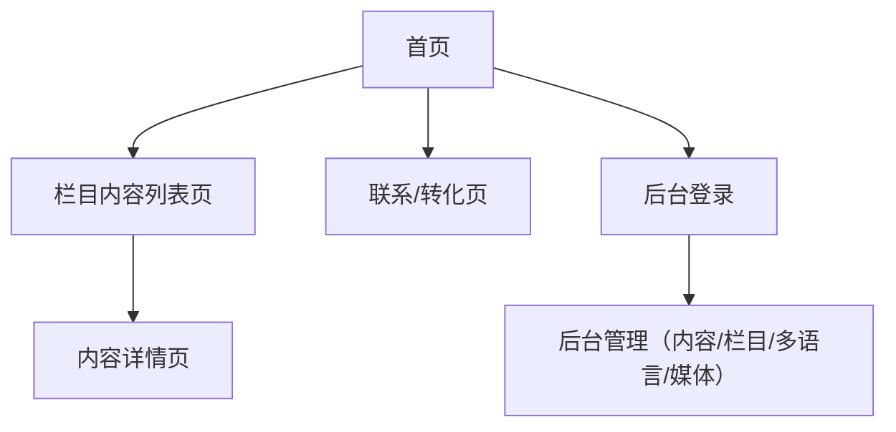

## 1. Product Overview
面向品牌对外展示的内容型官网，支持栏目化内容呈现、基础转化入口，并提供后台发布与多语言能力。
你可以用它统一管理与发布网站内容，并按语言版本对外展示。

## 2. Core Features

### 2.1 User Roles
| 角色 | 注册/开通方式 | 核心权限 |
|------|----------------|----------|
| 访客用户 | 无需注册 | 浏览各栏目内容、切换语言、提交联系表单（如启用） |
| 后台运营（编辑/管理员） | 由管理员在后台创建账号或通过 Supabase Auth 邀请 | 登录后台、创建/编辑/发布内容、管理多语言内容版本、上传媒体资源 |

### 2.2 Feature Module
本网站需求由以下核心页面组成：
1. **首页**：品牌主视觉、核心栏目入口、精选内容区块、全站导航与语言切换。
2. **栏目内容列表页（通用模板）**：按栏目展示内容卡片列表、基础筛选/分页、面包屑导航。
3. **内容详情页（通用模板）**：展示文章/案例等内容正文、媒体资源、关联内容推荐、分享信息（可选）。
4. **联系/转化页**：展示联系方式/二维码等信息、（可选）联系表单提交。
5. **后台管理（登录 + 内容发布）**：登录、栏目与内容管理、草稿/发布状态、多语言字段编辑、媒体库上传。

### 2.3 Page Details
| Page Name | Module Name | Feature description |
|-----------|-------------|---------------------|
| 首页 | 顶部导航与语言切换 | 展示主导航（各栏目入口）并切换当前语言版本（影响全站内容展示）。 |
| 首页 | 品牌与主视觉 | 展示品牌 Logo/主视觉、核心价值主张与主要行动入口（跳转到栏目或联系页）。 |
| 首页 | 精选内容区块 | 展示各栏目精选内容卡片，点击进入对应详情页。 |
| 栏目内容列表页 | 栏目信息与列表 | 根据栏目展示内容列表（标题/摘要/封面/发布时间等），支持分页（或加载更多）。 |
| 栏目内容列表页 | 导航辅助 | 展示面包屑与当前栏目定位，支持返回首页/上级。 |
| 内容详情页 | 内容渲染 | 根据内容类型渲染正文（富文本/图片/视频等），展示标题、发布时间等基础信息。 |
| 内容详情页 | 关联推荐 | 展示同栏目/标签的关联内容入口，便于继续浏览。 |
| 联系/转化页 | 联系信息 | 展示地址、邮箱、电话、社媒/微信二维码等固定信息。 |
| 联系/转化页 | 联系表单（可选） | 提交姓名/联系方式/留言等，并给出提交成功/失败反馈。 |
| 后台管理 | 登录 | 后台运营通过账号登录后进入管理界面。 |
| 后台管理 | 栏目管理 | 配置栏目（名称、排序、启用状态、URL slug、多语言名称）。 |
| 后台管理 | 内容管理 | 创建/编辑/预览/发布内容；管理状态（草稿/已发布/下线）、时间、封面与正文。 |
| 后台管理 | 多语言内容编辑 | 为同一内容维护不同语言版本字段（标题/摘要/正文/SEO），并控制是否随主语言发布。 |
| 后台管理 | 媒体库 | 上传与复用图片等资源，生成可用于内容的引用链接。 |

## 3. Core Process
- 访客浏览流程：进入首页 → 选择语言 → 进入某栏目列表 → 打开内容详情 → 返回继续浏览或进入联系页。
- 后台运营流程：登录后台 → 选择栏目/内容 → 编辑内容与多语言字段 → 预览 → 发布（前台即可按语言展示）。

